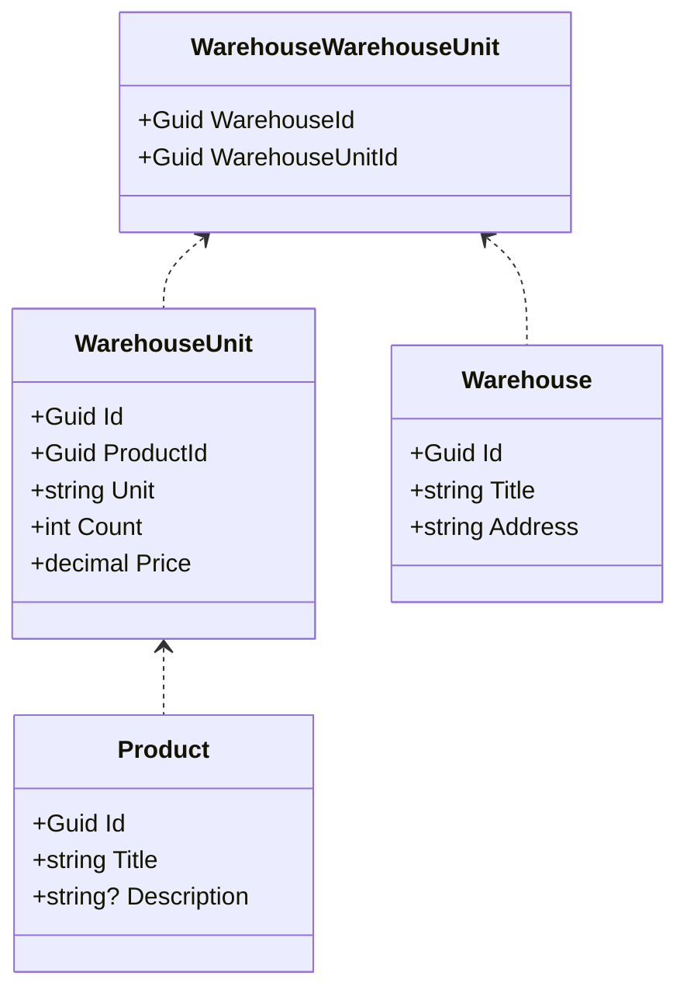

Описание предметной области
---
Простейшие API-контроллеры для работы со складами и товарами. Простейшая работа с сервисами в Blazor-Server


Автор
---
Кочетков Денис Александрович

Схема моделей
---

Установка программы
---
Для работоспособности приложения вам потребуется выход в интернет, и установленная БД MsSQL версии 18.12.1 или выше  

1.Зайдите в проект WarehouseManagement.Context/ WarehouseManagementContext  
2.Выполните 4 команду в консоли диспетчера пакетов  
3.В случае ошибки выполните 1 команду и повторите попытку  
4.После упешного создания БД запустите скрипт представленный ниже

Скрипт
---
```
USE WarehouseManagementDB
INSERT INTO [dbo].[Products]
           ([Id]
           ,[Title]
           ,[Description]
           ,[CreatedAt]
           ,[CreatedBy]
           ,[UpdatedAt]
           ,[UpdatedBy]
           ,[DeletedAt])
     VALUES
           ('181f5094-7bb2-494f-93b0-d1d131c37292'
           ,N'Огурец'
           ,N'Очень вкусный'
           ,GETDATE()
           ,'Test'
           ,GETDATE()
           ,'Test'
           ,NULL),
           ('6c76800c-2ed8-4c7c-a8dd-68e1e24f74a2'
           ,N'Томат'
           ,N'Очень вкусный'
           ,GETDATE()
           ,'Test'
           ,GETDATE()
           ,'Test'
           ,NULL),
           ('6e3eeb22-e6f6-4c42-aef5-c78f52fdee9b'
           ,N'Перец'
           ,N'Очень вкусный'
           ,GETDATE()
           ,'Test'
           ,GETDATE()
           ,'Test'
           ,NULL),
           ('bc045736-58a3-43eb-aeb0-42fe6a3384d8'
           ,N'Апельсин'
           ,N'Очень вкусный'
           ,GETDATE()
           ,'Test'
           ,GETDATE()
           ,'Test'
           ,NULL),
           ('fe42d928-e6b6-4e78-8fa4-7224a547b868'
           ,N'Мандарин'
           ,N'Очень вкусный'
           ,GETDATE()
           ,'Test'
           ,GETDATE()
           ,'Test'
           ,NULL)

	INSERT INTO [dbo].[WarehouseUnits]
           ([Id]
           ,[ProductId]
           ,[Unit]
           ,[Count]
           ,[Price]
           ,[CreatedAt]
           ,[CreatedBy]
           ,[UpdatedAt]
           ,[UpdatedBy]
           ,[DeletedAt])
     VALUES
           ('57e0c2b5-403f-42fb-ab8f-a827f68ac588'
           ,'181f5094-7bb2-494f-93b0-d1d131c37292'
           ,N'Кг.'
           ,1
           ,200.00
           ,GETDATE()
           ,'Test'
           ,GETDATE()
           ,'Test'
           ,null),
           ('8c564722-cb71-4bb7-aaca-93a654a83a22'
           ,'6c76800c-2ed8-4c7c-a8dd-68e1e24f74a2'
           ,N'Мешок'
           ,1
           ,2000.00
           ,GETDATE()
           ,'Test'
           ,GETDATE()
           ,'Test'
           ,null),
           ('8183e52b-efde-4ef9-8266-c2ed75fd54e1'
           ,'6e3eeb22-e6f6-4c42-aef5-c78f52fdee9b'
           ,N'Ящик'
           ,1
           ,1500.00
           ,GETDATE()
           ,'Test'
           ,GETDATE()
           ,'Test'
           ,null),
           ('2612f754-fb05-4791-9e1f-2c8e4f5fc060'
           ,'bc045736-58a3-43eb-aeb0-42fe6a3384d8'
           ,N'Кг.'
           ,1
           ,350.00
           ,GETDATE()
           ,'Test'
           ,GETDATE()
           ,'Test'
           ,null),
           ('bcb106f2-e69d-4964-8216-08ae4a491872'
           ,'fe42d928-e6b6-4e78-8fa4-7224a547b868'
           ,N'Кг.'
           ,1
           ,300.00
           ,GETDATE()
           ,'Test'
           ,GETDATE()
           ,'Test'
           ,null)

	INSERT INTO [dbo].[Warehouses]
           ([Id]
           ,[Title]
           ,[Address]
           ,[CreatedAt]
           ,[CreatedBy]
           ,[UpdatedAt]
           ,[UpdatedBy]
           ,[DeletedAt])
     VALUES
           ('15aa441a-49fe-4919-a55e-92c163460037'
           ,N'Яндекс Склад'
           ,N'Улица Пушкина д.2'
           ,GETDATE()
           ,'Test'
          ,GETDATE()
           ,'Test'
           ,null),
           ('c2798a8d-915c-4ad8-8271-05bbb87e0311'
           ,N'Пустосклад'
           ,N'Улица Пушкина д.7'
           ,GETDATE()
           ,'Test'
           ,GETDATE()
           ,'Test'
           ,null)

	INSERT INTO [dbo].[WarehouseWarehouseUnits]
           ([WarehouseId]
           ,[WarehouseUnitId])
     VALUES
           ('15aa441a-49fe-4919-a55e-92c163460037'
           ,'57e0c2b5-403f-42fb-ab8f-a827f68ac588'),
           ('15aa441a-49fe-4919-a55e-92c163460037'
           ,'8c564722-cb71-4bb7-aaca-93a654a83a22'),
           ('15aa441a-49fe-4919-a55e-92c163460037'
           ,'8183e52b-efde-4ef9-8266-c2ed75fd54e1'),
           ('15aa441a-49fe-4919-a55e-92c163460037'
           ,'2612f754-fb05-4791-9e1f-2c8e4f5fc060'),
           ('15aa441a-49fe-4919-a55e-92c163460037'
           ,'bcb106f2-e69d-4964-8216-08ae4a491872')
```
