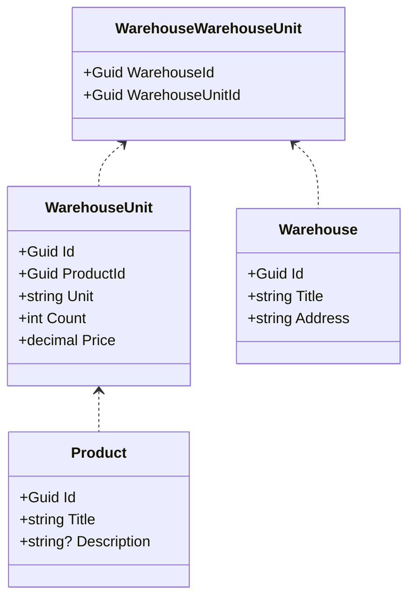

Описание предметной области
---
Простейшие API-контроллеры для работы со складами и товарами

Автор
---
Кочетков Денис Александрович

Схема моделей
---

Установка программы
---
Для работоспособности приложения вам потребуется выход в интернет, и установленная БД MsSQL версии 18.12.1 или выше  

1.Зайдите в проект WarehouseManagement.Context/ WarehouseManagementContext  
2.Выполните 4 команду в консоли диспетчера пакетов  
3.В случае ошибки выполните 1 команду и повторите попытку  
4.Запускайте
